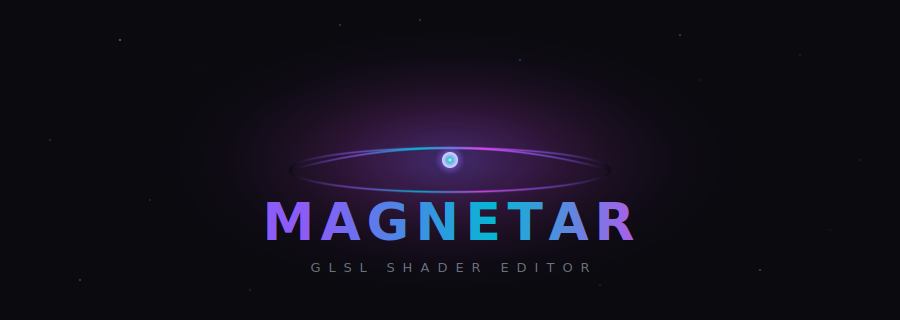
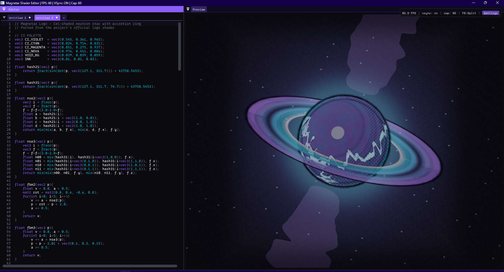
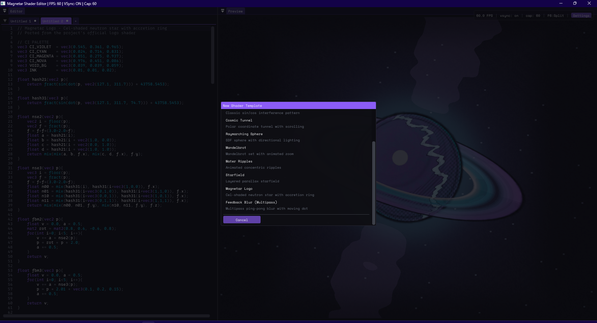

<p align="center">
  
</p>

<p align="center">
  <b>GPU-native GLSL shader editor with real-time preview</b><br/>
  <sub>C++ · SDL3 · Dear ImGui · OpenGL 4.5 Core</sub>
</p>

<p align="center">
  
  
  
  
  
</p>

---

<p align="center">
  
</p>

---

## What is this

Magnetar is a shader editor that talks directly to the GPU. No web runtime, no UI framework sitting between your fragment shader and the render pipeline. You write GLSL, it compiles and renders every frame at your monitor's refresh rate.

Built as a ground-up replacement for [gleditor](https://github.com/1ay1/gleditor) — same concept, none of the GTK compositing overhead.

## Features

<table>
<tr>
<td width="50%">

**🔮 Real-time preview**
- Renders to FBO via OpenGL 4.5 DSA
- 60fps locked with vsync, or uncapped
- Zero UI compositing overhead

**✏️ Code editor**
- GLSL syntax highlighting
- 209-item autocomplete
- Live error markers with line numbers
- Debounced recompilation (~300ms)

**🎨 Shadertoy compatible**
- Paste any `mainImage()` shader
- Full uniform support: `iTime`, `iResolution`, `iMouse`, `iDate`, `iFrame`, `iTimeDelta`
- Sign-encoded `iMouse` button state

</td>
<td width="50%">

**🔁 Multipass rendering**
- BufferA–D + Image pipeline
- Ping-pong FBOs for feedback effects
- Cross-buffer channel reads
- `//--- BufferA ---` section markers

**📑 Multi-tab workflow**
- Independent compile state per tab
- Session persistence across restarts
- Save/load `.glsl` files with native dialogs
- 10 built-in shader templates

**⚙️ Configurable**
- VSync toggle + framerate cap (0–240)
- Three view modes (Split / Editor / Preview)
- All settings persist to JSON

</td>
</tr>
</table>

<p align="center">
  
  <br/>
  <sub>10 built-in templates — from blank canvas to raymarching spheres to multipass feedback blur</sub>
</p>

## Keyboard shortcuts

| Shortcut | Action |
|----------|--------|
| `Ctrl+N` | New shader from template |
| `Ctrl+O` | Open `.glsl` file |
| `Ctrl+S` | Save |
| `Ctrl+Shift+S` | Save as |
| `Ctrl+W` | Close tab |
| `Ctrl+R` / `F5` | Force recompile |
| `F6` | Cycle view mode |
| `Ctrl+Q` | Quit |

## Build

### Requirements

- C++17 compiler (GCC/MinGW or MSVC)
- CMake 3.20+
- SDL3 (development libraries)
- OpenGL 4.5 capable GPU

### Windows (MSYS2 MinGW64)

```bash
pacman -S mingw-w64-x86_64-cmake mingw-w64-x86_64-ninja mingw-w64-x86_64-gcc mingw-w64-x86_64-SDL3

git clone https://github.com/botboy0/Shader.git
cd Shader
git submodule update --init    # pulls Dear ImGui

cmake -B build -G Ninja
cmake --build build
./build/magnetar.exe
```

### Linux

```bash
# Install SDL3 dev package (or build from source)
sudo apt install cmake ninja-build g++ libsdl3-dev

git clone https://github.com/botboy0/Shader.git
cd Shader
git submodule update --init

cmake -B build -G Ninja
cmake --build build
./build/magnetar
```

## Multipass shaders

Write all passes in a single file using section markers:

```glsl
// Shared helper functions go here (prepended to Image pass)
float hash(vec2 p) { return fract(sin(dot(p, vec2(127.1, 311.7))) * 43758.5453); }

//--- BufferA ---
//!channel0 self
void mainImage(out vec4 O, in vec2 U) {
    // Read previous frame (feedback)
    vec4 prev = texture(iChannel0, U / iResolution.xy);
    O = mix(prev, vec4(hash(U + iTime), 0, 0, 1), 0.02);
}

//--- Image ---
//!channel0 BufferA
void mainImage(out vec4 O, in vec2 U) {
    O = texture(iChannel0, U / iResolution.xy);
}
```

Channel directives: `//!channel0 BufferA`, `//!channel0 self` (for feedback). Supports `iChannel0`–`iChannel3` reading from `BufferA`–`BufferD` or `self`.

## Architecture

```
src/
├── core/           # App loop, ShaderRenderer (FBO + DSA), FrameControl
├── editor/         # CodeEditor (ImGuiColorTextEdit), ShaderCompiler, Autocomplete
├── shader/         # IShaderFormat, ShadertoyFormat, UniformBridge, MultipassPipeline
├── ui/             # ImGui manager, Layout, Theme, TabManager, Settings, Session
└── main.cpp        # Orchestration (~500 lines wiring everything together)

external/
├── imgui/          # Dear ImGui docking branch (submodule)
├── ImGuiColorTextEdit/
└── nlohmann/json.hpp
```

Key design choices:
- **DSA everywhere** — no `glBind*` state management, all `glCreate*` / `glProgramUniform*`
- **FBO → ImGui::Image()** — shader renders to texture, ImGui displays it. No compositing layer.
- **IShaderFormat interface** — pluggable format system. Only Shadertoy for now, raw GLSL / compute can be added later.
- **Tabs own GL programs** — renderer is a shared display surface, each tab manages its own compiled shader lifecycle.

## Palette

The Magnetar CI palette, used throughout the editor theme:

| | Color | Hex | Role |
|---|-------|-----|------|
| ◼ | Void Black | `#0a0a0f` | Background |
| 🟣 | Violet | `#8b5cf6` | Interactive elements |
| 🔵 | Cyan | `#06b6d4` | Highlights, builtins |
| 🟣 | Magenta | `#d946ef` | Active states, strings |
| ⚪ | Dust Gray | `#6b7280` | Borders, comments |
| ⬜ | Off-white | `#f9fafb` | Text |

Fonts: [0xProto](https://github.com/0xType/0xProto) for code, [Space Mono](https://fonts.google.com/specimen/Space+Mono) for UI.

## License

MIT

---

<p align="center">
  <sub>Built with obsessive attention to frame timing and zero tolerance for UI compositing overhead.</sub>
</p>
